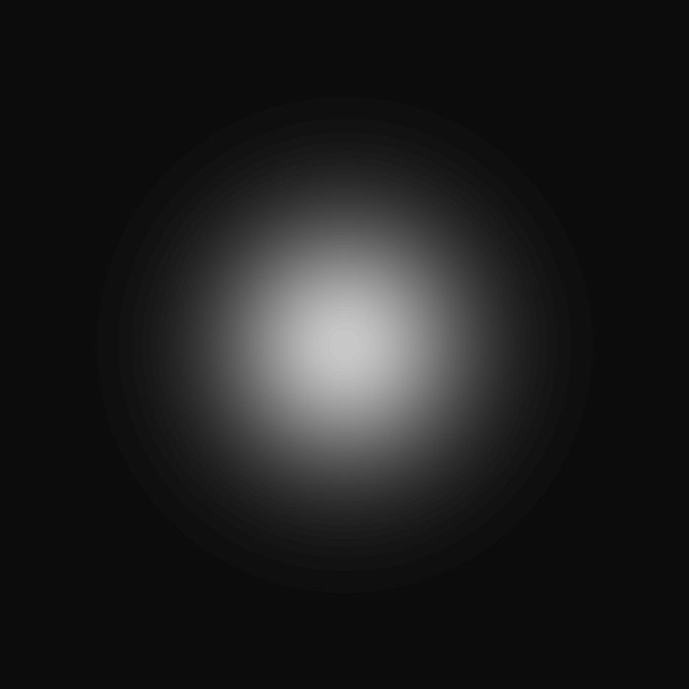

# MeinKraft

## Purpose:
MeinKraft is my End of first year project at Isart Digital Montreal. With the class, we chose to make a Minecraft-like because it was quite popular in our class, more we wanted to have a challenging project. Thus Minecraft was a very good choice finally, this was a hard-to-complete project within the deadlines, so we restricted our scopes, in order to complete most of the work. At the time, we were all proud of our production.

## Rules:
- Group : 3 people
- Duration : 5 weeks
- Language : C++
- Graphic API : OpenGL
	
## What have I done:
We were 3 on this project so obviously I didn't do everything myself, my parts were :

- OpenGL Rendering, the rendering is achieved using a Geometry Shader which construct every cube. Using this, we were able to save some space by just sending the cube position to the GPU (3 floats vs 9 floats).
- Multithreading, I've implemented a TaskPool in order to use mutiple threads easily.
- 3D Math, I've implemented, Quaternion for the rotation, Matrix4x4 for the transformations, Vector2D / 3D / 4D.
- World Generation, the generation is infinite(limited only by float max), it use a garbage collector to safely delete offscreen chunks, a custom noise algorithm(see more info below), and a vertical greedy meshing.
- Save / Load, the save system is multithreaded, so it can write multiple file at once. It's useful because we store the data such as each region have their own save file containing their chunks, we end up with a lot of file, but this permit us to load and save asynchronously. Every data is stored in binary to have lighter save file.

## World Generation:
Keyword :

- Region : a biome and chunk container
- Chunk : a block container

### Noise Algorithm:
As noise algorithm, I use a custom one. It use a 2D Gaussian function to create white point on an "image".

Having an image with multiple Gaussian function required me to subdivide the "image" in lower square.

Finally from this having a correct noise is not hard, we just need to blur the "image".

This noise algorithm is good however it's quite heavy, a 2D Gaussian function use the exponantial function, some division as well as power, moreover, bluring an image is quite heavy because it require us to iterate over every pixel, the larger the image is the longer it is to blur it.
This final noise was used as a Heightmap for a region and each pixel were a cube in the world.

### Issue:
Currently, we can see the border of each region, I tried , at the time, to correct this by blurring each border of each region by creating a subspace where the two border were connected, but this was not very succesful.
Now, I know that I need to use some interpolation algorithm such as Bezier's Curves.
